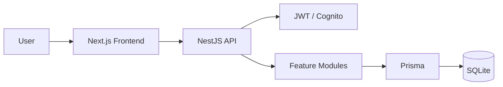

# ProjeX

<p align="center">
  <strong>Enterprise Project Management Platform</strong>
  <br />
  Plan projects, manage tasks, coordinate teams, track resources, and analyze progress from one platform.
</p>

<p align="center">


</p>

---

## Overview

**ProjeX** is a full-stack project management system designed around projects, tasks, teams, resources, workflows, analytics, and collaboration.

The platform combines multiple project-management workflows into a single system:

* Project & task management
* Kanban, list, table & timeline views
* Sprint & milestone tracking
* Team & resource management
* Organizations, roles & permissions
* Calendar & integrations
* Analytics & reporting
* Search & saved views
* Notifications
* AI-assisted project workflows

---

## Architecture



### Stack

| Layer          | Technology                        |
| -------------- | --------------------------------- |
| Frontend       | Next.js, React, TypeScript        |
| UI             | Tailwind CSS, Material UI, Lucide |
| State          | Redux Toolkit, RTK Query          |
| Backend        | NestJS, TypeScript                |
| Database       | Prisma + SQLite                   |
| Authentication | AWS Cognito + JWT                 |
| Testing        | Jest, Supertest                   |
| API Docs       | Swagger                           |
| CI             | GitHub Actions                    |

---

## Features

### Project Management

* Projects, tasks, dependencies and assignments
* Priorities, tags, watchers and due dates
* Kanban, List, Table and Timeline views
* Sprints and milestones
* Project templates
* Saved views

### Teams & Resources

* Organizations and memberships
* Teams and user management
* Skills and employee allocation
* Resource / bench tracking
* Project assignments

### Collaboration

* Comments and mentions
* Activity history
* Notifications and preferences
* Calendar integration
* GitHub / GitLab integrations

### Analytics

* Project dashboards
* Portfolio overview
* Activity analytics
* Reports
* Search history and frequently used searches

### AI

* Natural-language project search
* Task breakdown
* Report generation
* Planning assistance

---

## Project Structure

```text
ProjeX/
├── client/
│   └── src/
│       ├── app/              # Routes & pages
│       ├── components/       # Shared UI
│       ├── state/            # Redux & RTK Query
│       ├── lib/              # Utilities
│       └── styles/           # Design tokens
│
├── server/
│   ├── prisma/               # Schema, migrations & seed
│   └── nest/
│       └── src/
│           ├── modules/      # Feature modules
│           ├── common/       # Guards, filters & shared logic
│           ├── config/       # Environment configuration
│           ├── prisma/       # Prisma service
│           └── docs/         # API documentation
│
└── .github/
    └── workflows/             # CI
```

---

## Getting Started

### Requirements

* Node.js 20+
* npm
* Git

### Clone

```bash
git clone https://github.com/Harman8815/Project-Management.git
cd Project-Management
```

### Backend

```bash
cd server
npm install
cp .env.example .env

npx prisma migrate dev
npm run seed
npm run dev
```

API:

```text
http://localhost:8000
```

Swagger:

```text
http://localhost:8000/api/docs
```

### Frontend

```bash
cd client
npm install
cp .env.example .env.local
npm run dev
```

Application:

```text
http://localhost:3000
```

---

## Development

### Backend

```bash
npm run dev
npm run build
npm run typecheck
npm run lint
npm test
```

### Frontend

```bash
npm run dev
npm run build
npm run lint
```

---

## API

The backend API is versioned under:

```text
/api/v1
```

Core areas include:

```text
/projects
/tasks
/sprints
/milestones
/teams
/users
/search
/timeline
/comments
/notifications
/resources
/analytics
/reports
/organizations
/calendar
/ai
```

Detailed API documentation is available through Swagger.

---

## Database

ProjeX uses **Prisma with SQLite** for development.

The database contains models for:

```text
Users
Organizations
Projects
Tasks
Sprints
Milestones
Teams
Resources
Comments
Notifications
Calendar
Integrations
Analytics
Search
AI
```

---

## CI

GitHub Actions runs automated checks for:

* Server linting
* Type checking
* Backend tests
* Client linting
* Production build

---

## Roadmap

ProjeX is being evolved toward a complete enterprise project-management platform.

Planned areas include:

* Advanced workflow automation
* Deeper resource planning
* Portfolio management
* Advanced analytics
* Improved integrations
* AI-powered project workflows

---

## Repository

**GitHub:**
https://github.com/Harman8815/Project-Management

**Issues:**
https://github.com/Harman8815/Project-Management/issues

---

## License

ISC
