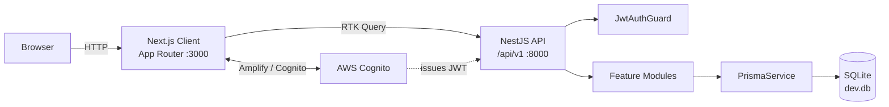
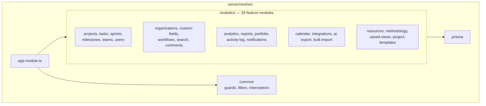

# ProjeX

Full-stack project management platform with task tracking, sprint planning, resource allocation, and an AI assistant — built with Next.js 14, NestJS, Prisma, and SQLite.


## Features

- **Projects & tasks** — create projects, track tasks with priority, status, tags, story points, watchers, dependencies, and due dates
- **Multiple views** — board (drag & drop), list, table, and Gantt-style timeline per project
- **Sprints & milestones** — time-boxed sprints with lifecycle tracking and project milestones
- **Organizations & roles** — organization membership, roles, settings, and custom field definitions
- **Resource management** — employee skills, bench tracking, project allocation, and employee transfers
- **Analytics & reporting** — dashboard charts, activity logs, portfolio views, and generated reports
- **Saved views** — persist filter, sort, and column configurations per view type
- **Methodology** — per-project Kanban / Waterfall / Scrum configuration
- **Calendar** — Google / Microsoft / CalDAV sync, iCal parsing, and event-to-task linking
- **Integrations** — GitHub / GitLab activity, project import & export, HMAC-verified webhooks
- **AI assistant** — natural-language task search, report generation, task breakdowns, and planning help
- **Search** — cross-entity search with recent and top-search history
- **Notifications** — in-app notifications with per-user preferences
- **Auth** — AWS Cognito sign-in via Amplify, JWT-guarded API, plus a development auth bypass

## Tech Stack

| Layer | Technology |
|-------|------------|
| Frontend | Next.js 14 (App Router), React 18, TypeScript 5 |
| Styling | Tailwind CSS 3, Material UI 5 + MUI X Data Grid, Lucide icons |
| State | Redux Toolkit 2, RTK Query, redux-persist |
| Charts | Recharts, gantt-task-react, FullCalendar 6 |
| Drag & drop | react-dnd 16 |
| Auth (client) | AWS Amplify 6, `@aws-amplify/ui-react` |
| Backend | NestJS 10, TypeScript 5 |
| Validation | class-validator, class-transformer, Joi |
| ORM | Prisma 5 |
| Database | SQLite |
| Auth (server) | jsonwebtoken, JWT guard |
| Docs | Swagger (`/api/docs`) |
| Testing | Jest 30, ts-jest, supertest (30 server spec files) |
| CI | GitHub Actions |

## Architecture





## Project Structure

```
.
├── client/                         # Next.js 14 frontend
│   ├── public/                     # static assets, avatars, logos
│   └── src/
│       ├── app/                    # App Router routes & layouts
│       │   ├── home/               # dashboard with charts
│       │   ├── projects/           # [id] board/list/table/timeline + all/
│       │   ├── timeline/           # Gantt timeline
│       │   ├── organization/       # org admin, custom fields, integrations
│               │   ├── resource-management/  # skills, bench, allocation
│       │   ├── calendar/           # FullCalendar views
│       │   ├── search/             # search + history
│       │   ├── priority/           # per-priority task views
│       │   └── settings|users|teams|notifications|assistant
│       ├── components/             # shared UI (Navbar, Sidebar, cards, modals)
│       ├── state/                  # Redux slice + RTK Query API
│       ├── lib/                    # helpers (dataGrid styles, API errors)
│       └── styles/                 # design tokens
└── server/                         # NestJS 10 backend
    ├── prisma/
    │   ├── schema.prisma           # 36 models, SQLite datasource
    │   ├── migrations/
    │   └── seed.ts                 # sample data seeder
    └── nest/src/
        ├── modules/                # 29 feature modules
        ├── common/                 # guards, filters, interceptors, decorators, DTOs
        ├── config/                 # Joi env validation
        ├── prisma/                 # PrismaService / PrismaModule
        ├── docs/                   # Swagger setup
        ├── services/               # shared services (dev seeding)
        └── app.module.ts
```

## Getting Started

**Prerequisites:** Node.js 20+ and npm.

```bash
git clone https://github.com/Harman8815/Project-Management.git
cd Project-Management
```

### 1. Backend

```bash
cd server
npm install
cp .env.example .env        # then edit if needed
npx prisma migrate dev      # create dev.db and apply migrations
npm run seed                # optional: sample data
npm run dev
```

API listens on `http://localhost:8000` (Swagger UI at `/api/docs`).

### 2. Frontend

```bash
cd client
npm install
cp .env.example .env.local
npm run dev
```

Open [http://localhost:3000](http://localhost:3000).

## Environment Variables

**`server/.env`** — validated by `nest/src/config/env.validation.ts`

| Variable | Required | Default | Description |
|----------|----------|---------|-------------|
| `DATABASE_URL` | yes | — | Prisma connection string, e.g. `file:./dev.db` |
| `PORT` | no | `3000` in code, `8000` in `.env.example` | API port |
| `JWT_SECRET` | no | insecure fallback | Token signing secret — **set in production** |
| `AUTH_DISABLED` | no | `false` | `true` bypasses the JWT guard for local dev |
| `DEV_KEY` | no | — | Key required to use dev endpoints when auth is enabled |
| `CORS_ORIGIN` | no | `*` | Allowed origin |
| `NODE_ENV` | no | `development` | Runtime environment |
| `AWS_REGION` | no | — | AWS region for Cognito |
| `COGNITO_USER_POOL_ID` | no | — | Cognito user pool |
| `COGNITO_CLIENT_ID` | no | — | Cognito app client |

**`client/.env.local`**

| Variable | Required | Default | Description |
|----------|----------|---------|-------------|
| `NEXT_PUBLIC_API_BASE_URL` | yes | — | API origin, e.g. `http://localhost:8000` |
| `NEXT_PUBLIC_COGNITO_USER_POOL_ID` | no | `""` | Amplify Cognito user pool |
| `NEXT_PUBLIC_COGNITO_USER_POOL_CLIENT_ID` | no | `""` | Amplify app client id |
| `NEXT_PUBLIC_AUTH_DISABLED` | no | — | `true` enables the client-side dev auth fallback |

> Never commit real values for `JWT_SECRET` or the Cognito ids. Both `.env` files are gitignored; commit `.env.example` only.

## Commands

### Server (`server/`)

| Command | Description |
|---------|-------------|
| `npm run dev` | Start NestJS in watch mode |
| `npm run build` | Compile TypeScript to `server/dist/` |
| `npm start` | Build, then run the compiled server |
| `npm run typecheck` | `tsc --noEmit` |
| `npm run lint` / `lint:fix` | ESLint |
| `npm run format` / `format:check` | Prettier |
| `npm run test` / `test:watch` / `test:coverage` | Jest suites |
| `npm run seed` | Seed the database from `prisma/seed.ts` |
| `npx prisma studio` | Browse the database in a GUI |

### Client (`client/`)

| Command | Description |
|---------|-------------|
| `npm run dev` | Next.js dev server on :3000 |
| `npm run build` | Production build |
| `npm start` | Serve the production build |
| `npm run lint` | ESLint via `next lint` |

> Stop `npm run dev` before running `npm run build` in the same directory — they share `.next/`, and building while the dev server is running corrupts its chunk manifest.

## API

All routes are prefixed with `/api/v1` and require `Authorization: Bearer <token>` unless `AUTH_DISABLED=true`.

```http
GET /api/v1/tasks?projectId=1
Authorization: Bearer <jwt>
```

Swagger UI is served at `http://localhost:8000/api/docs`.

| Area | Base path |
|------|-----------|
| Projects | `/projects` |
| Tasks | `/tasks` |
| Sprints & milestones | `/sprints`, `/milestones` |
| Teams & users | `/teams`, `/users` |
| Search | `/search` |
| Timeline | `/timeline` |
| Comments | `/comments` |
| Notifications | `/notifications` |
| Analytics & reports | `/analytics`, `/reports`, `/activity-log`, `/dashboard`, `/portfolio` |
| Resources | `/resources` |
| Methodology | `/methodology` |
| Saved views | `/saved-views` |
| Project templates | `/project-templates` |
| Project memberships | `/project-memberships` |
| Bulk import / export | `/bulk` |
| Organizations | `/organizations/:organizationId/…` — members, settings, custom fields, integrations, workflows |
| Calendar | `/organizations/:organizationId/calendar` |
| AI assistant | `/organizations/:organizationId/ai` |

## Database

Prisma with a **SQLite** datasource (`server/prisma/schema.prisma`), 36 models covering the core domain:

`User` · `Team` · `Project` · `ProjectTeam` · `ProjectMembership` · `ProjectTemplate` · `Task` · `TaskAssignment` · `TaskDependency` · `TaskWatcher` · `TaskHistory` · `Milestone` · `Sprint` · `Comment` · `CommentMention` · `Attachment` · `ActivityLog` · `Notification` · `NotificationPreference` · `Organization` · `OrganizationMembership` · `OrganizationSetting` · `CustomFieldDefinition` · `CustomFieldValue` · `Integration` · `IntegrationEvent` · `CalendarEvent` · `CalendarSync` · `AiRequestLog` · `AiFeedback` · `SearchQuery` · `UserSearchHistory` · `Skill` · `EmployeeSkill` · `MethodologyConfig` · `SavedView`

The datasource provider is pinned to `sqlite` in the schema, so switching to PostgreSQL requires changing the provider and re-running migrations.

## CI

`.github/workflows/ci.yml` runs on pushes and pull requests to `main` and `develop`: server lint, server typecheck, server tests, and client lint + build.

## License

ISC — see `server/package.json`.

## Links

- Repository: https://github.com/Harman8815/Project-Management
- Issues: https://github.com/Harman8815/Project-Management/issues
